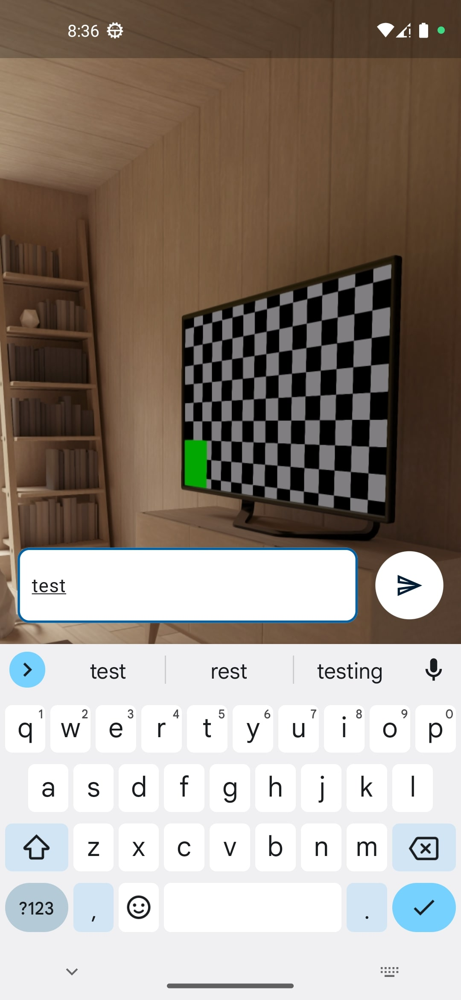
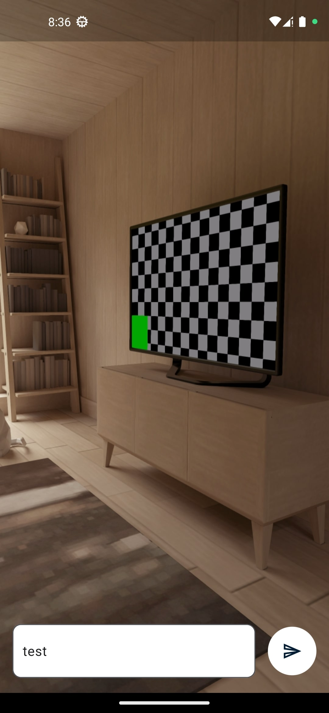
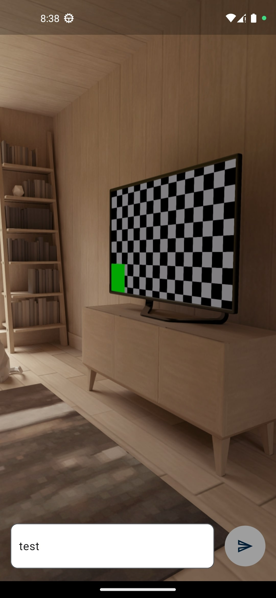

# Pyshop tech task for camera app

it's a simple tech task that requires creating a mobile app using flutter that sends data about user like input text, location, and photo to a remote server when pressing the send button

<pre>
               
</pre>

it has a simple check for sending data only once a second, so that the user doesn't spam upload requests

will try to add a pop-up to show the result after sending data in the future
